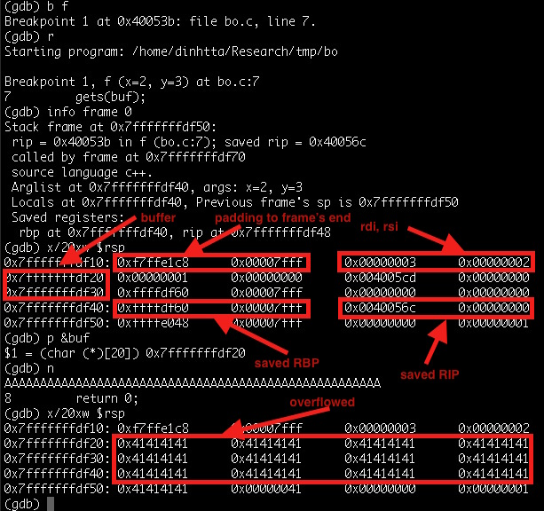
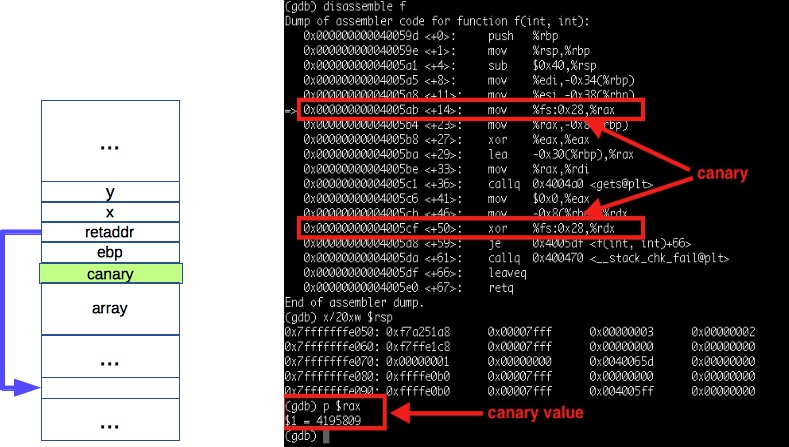

Computer security has established itself as a major, active and hugely impactful field of computer science. Its engine
is driven largely by a perpetual arm race between attacks and defenses, between breaking stuff and patching stuff. Helped
by disproportionate media interest and sometimes biased narratives, security comes off as a fear factor, as something to
be pessimistic about. It is true that the defense guys do not always take the spotlights, that only secure systems are
ones that do nothing and thus being useless. Nevertheless, computer security is an art, and portraying their principals
at work can be great movie material. Scorpion and Mr Robot, two popular Hollywood series with their the main
heroes being computer hackers, are raising public awareness and appreciation for security professionals.  

This post traces the evolution of memory vulnerabilities, one of the most important themes in computer security. In
fact, gun on my head, I would say it is **the** very essence of the field. Although if the same gun was on my head only
a month ago, the answer would have been different. Until last month, I was familiar with general ideas about memory
vulnerabilities, and could feign interest and awe when hearing about new vulnerabilities and exploits. Having attended
few research seminars on the subject, mostly on the defensive side, I had an impression that dealing with
vulnerabilities are mundane, ad-hoc process highly dependent of the architectural specifics. In retrospect, though,
those seminars were mainly from programming language community and thus were small, biased samples. I had been seeing
trees and didn't fully appreciate the forest.     

Memory vulnerabilities are gateways to gain control over somebody else's machines. As much as exposing holes in software
implementations, they embody creativity and humans' desire to tinker. But more importantly, they drive progress in many
aspects of computer science: from hardware, operating system, compiler, software design, to operations and management.
As far as a attack-defense arm race is concerned, defense sides appear to be at disadvantage, having to face 
challenging (undecidable) problems of software verification, predicting and accounting for human behavior (One thing I
learned from a short time working in the industry is that enterprises have come to accept security exploits as inevitable and
instead are treating them as risks and spending more resources in managing them). Seen from a research perspective,
however, memory vulnerabilities and related defense mechanisms are extremely educational tools. In the process of
understanding them, I learned great deals about hardware architecture, compilers, runtime, operating systems and other
cool software techniques.  I learned to appreciate the security processes previously perceived  as cumbersome if not
redundant. And I started to marvel at how incumbent operating systems and critical software systems manage to keep
themselves as secure as they are given their complexity.  

## Preventing corruption vs. exploitation 
Attacks based on memory vulnerabilities have two critical ingredients: the vulnerabilities themselves, and the
exploits. Vulnerabilities are the way in, allowing attackers to hijack the programs' control flows. To search for 
vulnerabilities, attackers often look for places where memory can be corrupted, which could be as simple as going
through the source code. Crafting and launching the corresponding exploits often require more craftsmanship. Defenders
use this division to gear their strategies, either to nip attacks at their buds by ensuring memory safety, or by making
exploits more difficult if not impossible.  

|**Phases** | **Attack techniques** | **Defense techniques** |
|---|---|---|
| Memory corruption | Stack, heap overflow. String format, integer vulnerabilities | Runtime memory checks |
| Exploits | Code injection, return-to-libc, ROP, blind hacking | NX, ASLR, CFI |
|---|---|---|

## Stack overflow

  

 *Figure 1. Stack layout when calling function f. The third figure illustrates control hijacking.* 

Running processes use stack for function calls. In Figure 1, calling <code> f(x,y) </code> comprises a number
of steps:

1. Push arguments to the stack: <code> push y, push x </code> (Though on AMD64 ABI, first 6 arguments are saved
in registers <code>rdi, rsi, rdx, ..</code>
2. Push current instruction pointer to the stack: <code> push eip </code>
3. Push the current frame pointer to the stack, and set frame pointer to be the current stack pointer. <code>
push ebp;  mov esp, ebp </code>. Frame pointer is an optimization to quickly retrieve function arguments. 
4. Allocate space for function variables by advancing the stack pointer. <code> add SIZE, esp 
5. Upon return (end of function), <code> retaddr </code> is popped off the stack and points to the next
instruction. And pointing the stack pointer to saved <code> ebp </code> effectively popping the entire stack
frame. 

*Figure 2. Overflow example using function (Figure 1) on AMD64 ABI.*

Figure 2 shows a real stack layout using GDB. The code was compiled on a x86-64 machine, therefore:

+ Arguments are not pushed on the stack, but instead are saved on registers rdi, rsi which are later pushed on the
stack prior to calling another function. 
+ Arrays are 16-byte aligned. And so are stack frame. Thus 32 bytes after saved <code> rip, rbp </code> are allocated to
<code>buf</code>. 

Nearly every work on stack overflows cite a classic paper in the late 90s describing the very first exploit
[1]. The basic technique is to write to local function variables beyond their limit thus to overwrite saved
return IP (<code>retaddr</code>). When the function returns, control is passed to a different address than
originally intended, thus the name _control hijacking_. In Figure 1, this is done by copying at least
<code>SIZE+8</code> bytes (on 32-bit machines) on to <code>array</code>, where
<code>[[SIZE+4]..[SIZE+8])</code> byte is a new address under the attacker's control. 

In our example (Figure 2), <code>buf</code> is pushed on the stack at address <code>0x7fffffffdf20</code> (there are
also 12 bytes of padding at the end). After copying 53 <code>A</code> characters, both the save <code>rbp</code> and
<code>rip</code> are overflowed with <code>A</code>. Running this inevitably leads to <code>Segmentation fault</code>.

### Exploiting it. 
Exploiting this corruption, back in late 90s, is done by writing attacking (or exploit) payloads --- often
spawns a shell --- to the stack itself and pointing the new return address there. To accomplish this, attackers have to
solve two subtle challenges:

+ When the buffer is large enough to contain exploit code, one challenge is to work out the exact address to
point the corrupted <code>retaddr</code> to. Guessing is the best strategy here, helped by prepending
<code>NOP</code> (no operation) instructions to beginning of the code, thus soften the damage when mishitting
(which would otherwise cause segmentation faults).

+ When the buffer is small, exploit code must be delivered in some other ways. Most common technique is to
store it in an environment variable which is pushed to the stack at the beginning.  

## Countermeasures - NX, canaries, baggy bounds
One prerequisite of the above's exploit is that codes can be executed on the stack: the corrupted return
address points to an address at which the CPU would happily execute instructions. Realizing this requirement,
the hardware community was quick to propose a countermeasure. 

**Countermeasure 1: memory can be either writable or executable, but not both.** Referred to as **NX**, it
essentially is a bit checked by CPUs before executing or writing to a memory address. When set properly by
compilers, this bit eliminates a significant channel for exploit delivery: it forbids attackers from running their
own codes on the corrupted servers.

Another observation of the above's exploit is that corruption to values on the stacks go unnoticed: CPUs would
treat <code>AAAA</code> as any other valid return address. Programming language community was quick to come up
with a solution. 

 
*Figure 3. Stack canaries*

**Countermeasure 2: protect return address integrity by canaries.** In function prologue (containing
instructions executed after <code>call</code>), compilers would push canaries (random, secret values) on the
stack right after pushing the return address. In function epilogue (instructions executed before
<code>ret</code>), compilers would check if canaries are correct. Figure 3 illustrates a poor-man solution to
return address integrity. Stack canaries are enabled by default on <code>g++</code> (at least for 4.8.4 version). When
running <code>f</code>, its stack content looks the same as without canaries. However, the code section of
<code>f</code> now contains additional instructions:

+ Canary value is stored on <code>%fx:0x28</code> (a thread local storage), and pushed on the stack after
<code>rbp</code>. Its value is set to current <code>%rax</cdoe> value: <code>4195809</code>.
+ Canary is checked for integrity before returning. Failing this, an error is raised. 

Countermeasure 1 and 2 are examples of exploit prevention, but they are essentially dealing with symptoms. To
remove the causes, it is clear that memory safety mechanism is in need to eliminate any chance of memory
corruption. 

**Countermeasure 3: bound checking to ensure memory safety.** One reason why C/C++ are fast is because of its
lack of memory safety, thus allowing one to write beyond objects boundary. Java, for instance, prohibits such
behaviors. Basic ideas behind memory safety are to perform bound checking before writing to objects (which
C/C++ relies on developers to do). Baggy bounds [2] is one proposal which enhance C/C++ memory safety by
storing and consulting bound information in a separate table. 

## Heap overflow, string and integer vulnerabilities 

## Return to libc, ROP 

## Countermeasures 2 - ASLR, Control Flow Integrity

## Blind hacking and breaking CFI

## Countermeasures 3 - Code Pointer Integrity

## Countermeasures 4 - Sandboxing, SFI

[1] Smashing the stack for fun and profit
