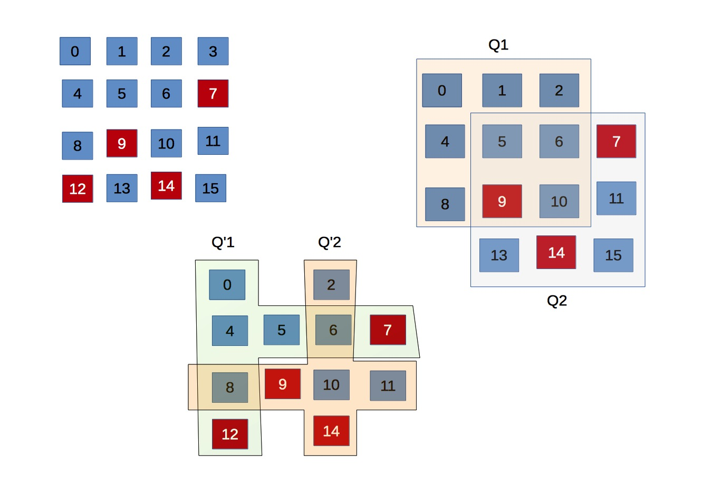

During the course of my continuing struggle with PBFT, which deserves its own blog entry, I caught a reference
to a term *dissemination quorum*. Previously content with the explanation of quorum being a fanciful term for
describing a subset of nodes, of which the most common type is majority quorum, I followed the references
rather reluctantly. And boy was I served a big humble pie.

The idea of quorums and quorum system dates as far back as the time when computer failures were recognized as
a real problem. It exists before FLP, before Paxos, and by extension, long before PBFT. The reason why it
rarely surfaces can be attributed to its theoretical nature. And similar to FLP, its popularity was eclipsed
by the popularity of later work that take the theoretical results and make them more practical. Studies of
quorum systems pave the way for Paxos, PBFT and many other work in making distributed systems tolerant to
failures. The paper being dissected in this post is Malkhi et. al.'s "Byzantine quorum systems" published in
1997 (2 years before Castro et al.'s PBFT).

## What is a quorum?

Given a set of node $$U$$, a quorum system is a set of subsets of $$U$$ (or quorums) in which **any two quorums
intersect**. More formally, $$Q$$ is a quorum system defined as $$Q \subseteq \mathbb{P}(U) \ \wedge \ \forall q_1, q_2
\in Q [ q_1 \ \cap \ q2 \neq \emptyset ]$$ 

## Examples

A set of majority subsets in $$U$$ is a quorum system. In fact, it is the most common instance of quorum systems,
found most often in fault-tolerant protocols. Paxos, in particular, relies on quorums of size $$f+1$$ in network of
$$2f+1$$ nodes. However, there are other examples whose quorums are not majority set. 

The figure above illustrates two quorum systems derived from $$U$$ of 16 nodes. The first system, called majority
quorum, is made up of majority-set quorums wherein each quorum is of size 9. The second, called grid quorum, consists of
quorums of size 7, but each pair always intersects at least 2 nodes. There are $$|U|$$ quorums in this example, where
$$q_{ij}$$ comprises node in row $$i$$ and column $$j$$. 

## Why quorums are useful
Quorums are useful in the context of replicated systems, be it a replicated storage or a more general
replicated state machine. A quorum serves as a representative of the entire system, and it can service client
requests on behalf the system. It means that a client needs only to contact the nodes in a quorum, as opposed
to all the nodes. And thanks to quorum intersection, updates made in one quorum can be made consistent by
propagating them to the rest of the network. Two immediate benefits are:

1. Performance via load balancing: two client requests may be served concurrently by two quorums, and the busy
nodes can be opted-out of the serving quorum until its load goes down. 

2. Fault tolerance: the system continue to work even when there are node failures, as long as a quorum is
still available. Original quorum systems were designed for crash-failure, which exploits quorum intersection
to keep failed nodes up-to-date once they are recovered. In Byzantine settings, that faulty nodes can
infiltrate quorums requires more complex reasoning and imposes more conditions on quorums --- exactly what
Malkhi et. al. set out to do in their paper.

## Quorum systems 
Properties of a quorum system can only be discussed under specific application model, and under specific
failure model. As discussed below, these models are very abstracted, and therefore rather simplistic. One
reason may be that when the idea was first proposed, large-scale distributed systems and their glorious
complexity did not yet exist, thus these models could be considered realistic. Regardless, the abstract models
make it easy to analyze the system formally. 

### APIs
A quorum system exposes shared read/write register over multiple client. In today's terms, it is treated as a
remote storage with read/write APIs accessible by many clients. Let $$Q$$ be a random quorum; it truly doesn't
matter which quorum, only that it is of a certain sizes.

* **Write**: the client queries all nodes $$n in Q$$ for a set of timestamps $$\{t_i\}$$. It then picks $$t =
max(\{t_i\})$$ and computes $$t' > t$$ in a way that two clients' picks are not the same. Finally, it sends
the data to $$Q$$ and waits until it is acknowledged by all nodes in $$Q$$.

* **Read**: the clients queries $$Q$$ for a set of $$\{(v_i, t_i)\}$$. It runs this set through a function
$$Result(.)$$ which returns the correct value. 

The write API, in practical terms, is not very efficient because it is interactive, requiring many rounds of
communication. Modern storage systems, for instance, incur only 1 round of communication by dedicate primary
nodes to serve requests of specific ranges. The quorum write API is simple, but more importantly it removes
additional trust assumed on the primary nodes. As for read API, details of $$Result(.)$ depends on assumptions
about data property, namely if the data is tamper proof (integrity protect). It also depends on how the nodes
fail.

### Failure model

## Non-authenticated quorum - Masking
Why?? 
Intuition behind 2f+1

## Authenticated quorum - Dissemination

## Quorum vs Paxos

